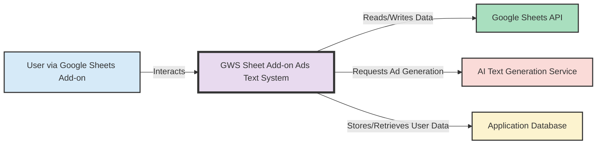
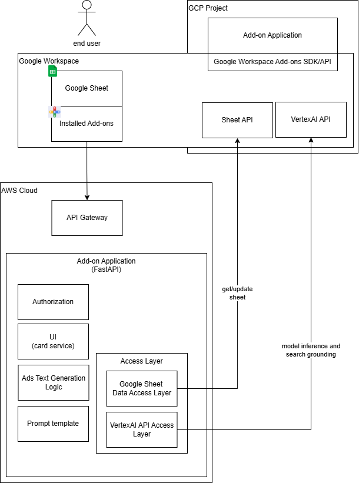

# Google Sheet Ads Text Generator Add-on

A Google Sheet add-on that generates compelling ad text for products listed in a spreadsheet. The add-on uses Google's Gemini AI (with its integrated Google Search tool) to create tailored ad copy. This add-on is built using HTTP endpoints (Alternate Runtimes) for Google Workspace.

## Project Overview

This add-on allows users to:
- Input product information in Google Sheets.
- Trigger ad generation via a Card Service UI.
- Specify the data range, header row, output column, and generation parameters (tone, length).
- Have generated ad text and reference data written directly back to their sheet.

Under the hood, the add-on:
- Receives requests from Google Workspace at specified HTTP endpoints.
- Obtains the Sheet ID from the event object.
- Uses the Google Sheets API (with user's OAuth token) to read header and row data.
- Infers column meanings from header names.
- Uses the Google Search tool within the Gemini API for contextual product information retrieval.
- Uses RAG (Retrieval-Augmented Generation) with Google Gemini to create compelling ad text and reference data.
- Writes the results directly back to the specified columns in the Google Sheet using the Sheets API.
- Stores product data and generation history in a PostgreSQL database.

## Architecture

- **Backend**: Python with FastAPI, serving HTTP endpoints for the Google Workspace Add-on.
- **Python Environment & Packaging**: `uv` with `pyproject.toml`.
- **Database**: PostgreSQL.
- **AI & Context Retrieval**: Google Gemini API (including its Google Search tool).
- **Google Sheet Integration**: Card Service UI (JSON defined by backend, rendered by Google) for input, direct data write-back via Sheets API.

## System Context Diagram

This diagram shows how the "GWS Sheet Add-on Ads Text" system interacts with external users and systems.



**Explanation of Context Diagram:**

*   **User (via Google Sheets Add-on)**: The primary actor who uses the add-on within Google Sheets to generate ad text.
*   **GWS Sheet Add-on Ads Text System**: The core application we are analyzing.
*   **Google Sheets API**: The system interacts with this API to read input data from sheets and write the generated ad text back.
*   **AI Text Generation Service**: An external or internal service that the system calls to perform the actual ad text generation based on provided inputs and prompts.
*   **Application Database**: Used by the system to store user information, authentication details, and potentially other application-specific data.

## Architecture Overview Diagram

The following diagram illustrates the overall architecture of the GWS Sheet Add-on Ads Text System:



**Explanation of Architecture Overview:**

This system is designed with distinct components to integrate with Google Workspace, leverage cloud hosting for the backend, and utilize Google Cloud services for AI and data manipulation.

*   **End User**:
    *   **Purpose**: The primary actor who initiates ad text generation.
    *   **Interaction**: Interacts directly with **Google Sheet** within the **Google Workspace** environment.

*   **Google Workspace**:
    *   **Google Sheet**:
        *   **Purpose**: The user's primary interface for inputting product data and viewing generated ad text. It's where the add-on is installed and accessed.
    *   **Installed Add-ons**:
        *   **Purpose**: Represents the deployed Google Workspace Add-on. It provides the UI elements (cards) within Google Sheets and acts as the trigger point for the backend processes.
        *   **Interaction**: When the user interacts with the add-on (e.g., clicks a "Generate Ads" button), it initiates a request to the backend system.

*   **AWS Cloud**:
    *   **Purpose**: Provides the hosting environment for the backend application, ensuring scalability and reliability.
    *   **API Gateway**:
        *   **Purpose**: Serves as the secure and managed entry point for all incoming requests from the Google Workspace Add-on to the backend application. It handles request routing, and can also manage aspects like authentication and rate limiting.
        *   **Interaction**: Receives HTTPS requests from the **Installed Add-ons** and forwards them to the **Add-on Application (FastAPI)**.
    *   **Add-on Application (FastAPI)**:
        *   **Purpose**: This is the core backend server built with the Python FastAPI framework. It houses all the business logic for the add-on.
        *   **Components**:
            *   **Authorization**:
                *   **Purpose**: Manages user authentication and authorization, ensuring that only legitimate users can access the service and its features. It verifies user identity, potentially using tokens provided by Google Workspace or its own session management.
            *   **UI (card service)**:
                *   **Purpose**: Responsible for dynamically generating the JSON structures that define the user interface cards (e.g., homepage, input forms, notification messages) displayed by Google Workspace in the Google Sheets sidebar or dialogs.
            *   **Ads Text Generation Logic**:
                *   **Purpose**: The central engine that orchestrates the ad creation process. It takes user inputs (product data, generation parameters), prepares data for the AI model, manages the interaction with the AI service, and processes the AI's output.
            *   **Prompt template**:
                *   **Purpose**: Stores and manages predefined text structures (prompts) that are used to instruct the AI model on how to generate the ad text, ensuring consistency and desired output style (e.g., tone, length).
            *   **Access Layer**:
                *   **Purpose**: A dedicated layer that abstracts and manages all external API communications, making the core application logic cleaner and easier to maintain.
                *   **Google Sheet Data Access Layer**:
                    *   **Purpose**: Specifically handles all interactions with the **Sheet API** (in GCP). Its responsibilities include fetching data from the user's Google Sheet, parsing it, and writing the generated ad text (and any other relevant information) back to the sheet.
                    *   **Interaction**: Makes "get/update sheet" calls to the **Sheet API**.
                *   **VertexAI API Access Layer**:
                    *   **Purpose**: Manages communication with the **VertexAI API** (in GCP). It sends the prepared data and prompts to the AI model and retrieves the generated ad text. It handles tasks like "model inference and search grounding" if the AI model uses search capabilities.
                    *   **Interaction**: Calls the **VertexAI API**.

*   **GCP Project (Google Cloud Platform Project)**:
    *   **Purpose**: The logical container within Google Cloud that hosts and manages the Google services utilized by the add-on, such as APIs and potentially the add-on's registration.
    *   **Add-on Application (GCP Descriptor)**:
        *   **Purpose**: Represents the add-on's identity and configuration within the GCP ecosystem. This could include API keys, OAuth client IDs, and service account configurations necessary for the backend to authenticate and use Google APIs.
    *   **Google Workspace Add-ons SDK/API**:
        *   **Purpose**: The set of libraries, tools, and API specifications provided by Google that the backend application (and the add-on manifest) uses to integrate with Google Workspace, define UI cards, and handle events.
    *   **Sheet API**:
        *   **Purpose**: A Google Cloud service that provides programmatic access to read from and write to Google Sheets. This is crucial for the add-on to get input data and deliver results.
    *   **VertexAI API**:
        *   **Purpose**: A Google Cloud service providing access to powerful AI models (like Gemini). This is used for the core task of generating creative and relevant ad text.

This detailed explanation should help new developers understand the role and purpose of each component in the architecture.

## User Interaction Flow & Endpoints

1.  **Homepage (`/gws/homepage`):**
    *   User opens the add-on.
    *   A simple card is displayed with a "Generate Ads" button.

2.  **Generate Ads Form (`/gws/generateAdsForm`):**
    *   Triggered by the "Generate Ads" button on the homepage.
    *   Presents a form card with the following inputs:
        *   "Data Rows Range (e.g., Sheet1!A2:D100)" (Required)
        *   "Header Row Number (e.g., 1)" (Required)
        *   "Output Starting Column Letter (e.g., E):" (Required)
        *   "Tone:" (Optional, with a default)
        *   "Max Ad Length:" (Optional, with a default)
    *   A "Generate & Write Ads" button on this form calls the `/gws/generateAndWriteAds` endpoint.

3.  **Process and Write Ads (`/gws/generateAndWriteAds`):**
    *   Receives form inputs and the Sheet ID (from the event object).
    *   Reads header row and data rows from the sheet using Sheets API.
    *   For each data row, creates a dictionary mapping header names to cell values.
    *   Calls the AI service (`generate_batch_ads_with_search`) with this structured data.
    *   The AI service returns generated ad text and reference data (e.g., search queries used).
    *   Writes the ad text and reference data directly back to the sheet in columns starting from the "Output Starting Column Letter".
    *   Returns a success/failure notification card.

## Changelog

### Planning Phase 3 (Latest - Direct Write-back)
- [x] Refined user input to a single form for data range, header row, output column, and generation parameters.
- [x] Decided to infer column meanings from header names rather than explicit mapping.
- [x] Planned for direct write-back of results to the sheet, removing intermediate results card.
- [x] Confirmed Sheet ID is available in the event object for relevant triggers.
- [x] Resolved token verification issues (audience claim, service account email).
- [x] Migrated to the new `google-genai` SDK.
- [x] Implemented Sheets API calls to read header and data rows within `/gws/generateAndWriteAds`.
- [x] Parsed sheet data based on headers.
- [x] Updated `app/services/ai_service.py` to accept row data as `Dict[str, str]` and for its prompt to infer meaning from headers.
- [x] Updated `ai_service` to return reference/strategy data along with ad text.
- [x] Corrected `Tuple` import in `app/api/gws_router.py`.

### Previous Milestones
- [x] Switched to Google Workspace Add-on with HTTP Endpoints.
- [x] Adopted `uv` and `pyproject.toml`.
- [x] Decided to use Google Search tool within Gemini API.
- [x] Basic project structure, FastAPI setup, DB models, CRUD, Auth, Alembic.
- [x] `Dockerfile` and `docker-compose.yml` created.
- [x] Initial database migration applied.
- [x] `gsheet/manifest.json` for HTTP endpoints created and refined.

### Pending Tasks

#### Core Backend & API
- [x] Implement the `/gws/generateAdsForm` endpoint to return the detailed input card. (Assumed complete as per previous steps, card structure is defined)
- [x] Implement the `/gws/generateAndWriteAds` endpoint:
    - [x] Extract form inputs and Sheet ID.
    - [x] Implement Sheets API calls to read header and data rows.
    - [x] Parse sheet data based on headers.
    - [x] Update `app/services/ai_service.py` to accept row data as `Dict[str, str]` and for its prompt to infer meaning from headers. (Completed)
    - [x] Update `ai_service` to return reference/strategy data along with ad text. (Completed)
    - [x] Implement Sheets API calls to write ad text and reference data back to the sheet. (Completed for ad_text, reference data write-back can be a future enhancement if needed beyond notification)
    - [x] Return a success/failure notification card. (Implemented)
- [x] Update `gsheet/manifest.json` to include `https://www.googleapis.com/auth/spreadsheets` scope for write access. (This is crucial for the write-back functionality to work)

#### Google Workspace Add-on Configuration
- [x] Test the full end-to-end flow by deploying the backend and installing the add-on in Google Sheets.

#### Deployment & Testing
- [ ] Prepare deployment scripts/configuration (e.g., for EKS).
- [ ] Write unit and integration tests.

## Getting Started (with uv and pyproject.toml)

1.  **Install uv:**
    Follow the official instructions at [astral.sh/uv](https://astral.sh/uv).

2.  **Create and Activate Virtual Environment:**
    ```bash
    uv venv
    source .venv/bin/activate  # Linux/macOS
    # .venv\Scripts\activate  # Windows
    ```

3.  **Install Dependencies:**
    ```bash
    uv sync
    ```

4.  **Set up Environment Variables:**
    Copy `.env.example` to `.env` and fill in your details (DATABASE_URL, GEMINI_API_KEY, SECRET_KEY, GCP_OAUTH_CLIENT_ID, SERVICE_ACCOUNT_EMAIL).

5.  **Run Database (Docker Compose):**
    ```bash
    docker-compose up -d db
    ```

6.  **Run Database Migrations:**
    ```bash
    docker-compose run --rm app python -m alembic upgrade head
    ```

7.  **Run the Application (Development with Docker Compose):**
    ```bash
    docker-compose build app # Rebuild if code changes
    docker-compose up app
    ```
    The application will be available at `http://localhost:8000`. Use `ngrok http 8000` to get a public HTTPS URL for testing the add-on.

## License

*License information will be added here*
